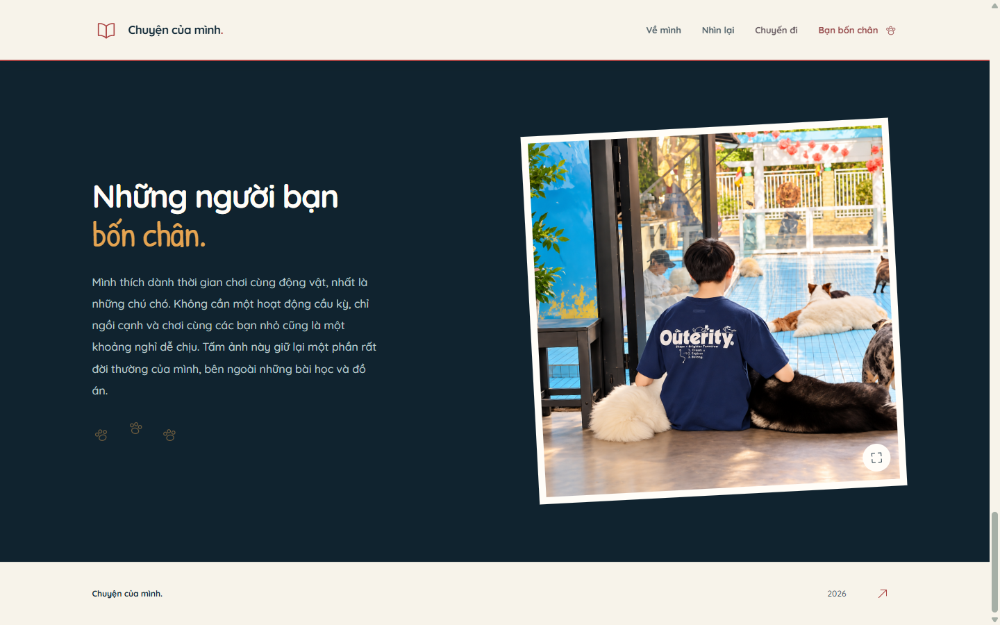

# Mình, hôm nay

Portfolio cá nhân bằng ảnh: mình ở hiện tại, những kỷ niệm và những điều mình thích. Flask, CSS và JavaScript thuần; 9 ảnh gốc trong `img/`, không cần API bên ngoài.

## Xem trước



[Về mình](docs/preview-about.png) | [Nhìn lại](docs/preview-journey.png) | [Giao diện điện thoại](docs/preview-mobile.png)

## Chạy local

Trên Windows, chạy:

```text
run.cmd
```

Sau đó mở [http://127.0.0.1:5059/](http://127.0.0.1:5059/). Chạy lệnh trong thư mục `GioiThieuBanThan`. Script tạo `.venv` bằng `py -3` hoặc `python` khi không có Python Launcher, rồi kiểm tra/cài dependencies mỗi lần chạy để có thể tiếp tục sau một lần cài bị gián đoạn.

Máy cần Python 3.9 trở lên. Lần cài Flask đầu tiên cần internet; khi dependencies đã có, có thể chạy trang offline.

Hoặc chạy thủ công:

```powershell
py -3 -m venv .venv
.\.venv\Scripts\python.exe -m pip install -r requirements.txt
.\.venv\Scripts\python.exe app.py
```

Mặc định server chỉ lắng nghe tại `127.0.0.1`, cổng `5059`, debug tắt. Có thể đổi cổng hoặc chủ động bật debug trong PowerShell:

```powershell
$env:PORT = "5060"
$env:FLASK_DEBUG = "true"
.\.venv\Scripts\python.exe app.py
```

`FLASK_DEBUG` chỉ bật với `1`, `true`, `yes`, `on` (không phân biệt chữ hoa/thường). Các giá trị khác, kể cả `false` và `0`, đều tắt debug. `PORT` phải là số cổng hợp lệ. Nhấn `Ctrl+C` để dừng server. Đây là server phát triển để xem local.

## Tương tác và chạy offline

Nội dung, ảnh và menu vẫn đọc được khi tắt JavaScript. Khi bật JavaScript, menu đóng bằng Escape, bấm ngoài hoặc chọn liên kết; điều hướng đánh dấu mục đang đọc. Hai tấm ảnh Ngày ấy/Hôm nay được đặt lên trang sổ trong một chuỗi ngắn, đường kỷ niệm theo vị trí cuộn và dấu chân phản hồi khi hover/focus ảnh động vật. Không có hoạt ảnh lặp vô hạn; reduced-motion và tab ẩn hủy các hiệu ứng JavaScript đang chạy.

Album gồm 9 ảnh theo thứ tự trên trang, bắt đầu từ ảnh hero. Lightbox dùng `<dialog>` native, có nút trước/sau, phím mũi tên trái/phải và thao tác vuốt/drag ngang. Chuyển ảnh có hướng, hỗ trợ chuyển liên tục; có trạng thái tải/lỗi, đóng bằng Escape, nút đóng hoặc backdrop. Tab/Shift+Tab giữ focus bên trong; khi đóng, focus quay về ảnh đã mở.

JavaScript, CSS, ảnh và font được phục vụ từ dự án. Patrick Hand và Quicksand 500/700 nằm trong `static/fonts/` cùng giấy phép SIL Open Font License (OFL). Font chữ viết tay đã được kiểm tra đủ ký tự tiếng Việt dùng trong trang. Không tải Google Fonts hoặc gọi API online khi xem trang. Nếu trình duyệt không hỗ trợ Web Animations hoặc IntersectionObserver, nội dung vẫn đọc được.

## Kiểm tra

```powershell
.\.venv\Scripts\python.exe -m unittest discover -s tests -v
node --check static/js/main.js
```

Các kiểm tra Python dùng Flask test client cho trang chủ, 9 ảnh gốc, CSS/JS, file không tồn tại, đường dẫn vượt thư mục và HTML escaping. `node --check` chỉ kiểm tra cú pháp JS; kiểm tra menu, dialog, bàn phím và responsive cần thực hiện thêm trên trình duyệt sau khi ghép giao diện.

Có thêm kiểm tra cặp Ngày ấy/Hôm nay, icon SVG, đủ 9 nút ảnh và các đích điều hướng. [DESIGN.md](DESIGN.md) ghi cách rút gọn nội dung và các mẫu hoạt ảnh tham khảo từ dự án UI-UX local; không sao chép thư mục hoặc tài nguyên của các dự án đó.

Kết quả kiểm tra trình duyệt sau tích hợp được ghi ở [docs/QA.md](docs/QA.md). Đây là kiểm tra trên trình duyệt desktop với các viewport mô phỏng, không phải kiểm tra trên điện thoại vật lý hoặc đánh giá WCAG đầy đủ.

## Chỉnh nội dung

Nội dung hiển thị nằm trong `profile_data.py`: hai đoạn giới thiệu (`intro`, `intro_more`), lời kể cho từng dấu mốc (`timeline`), mô tả dưới ảnh du lịch (`travels.description`) và đoạn về động vật (`animal.text`). Ảnh được giữ trong thư mục `img/` để trang chạy được cả khi không có internet.

## Phạm vi repository

Phạm vi repository riêng tư là các file thuộc dự án `GioiThieuBanThan`, không bao gồm các thư mục anh em trong `D:\Code\PythonMaster`. Không đưa `.venv`, cache Python, thông tin đăng nhập hoặc cấu hình riêng của máy lên repository. Việc chỉnh sửa local không tự tạo commit hay push; trạng thái riêng tư trên GitHub cần được xác nhận khi xuất bản.
